# Hospital Career Monitor

An AI-powered staffing intelligence tool that aggregates hospital job postings from Greenhouse and Lever ATS APIs, normalizes them with Gemini, and surfaces hiring trends through a React dashboard.

Built for healthcare staffing agencies and recruiters who need real-time visibility across multiple hospital systems — without manually checking dozens of career pages.

---

## What It Does

- **Aggregates** job postings hourly from 8 hospital/health systems via Greenhouse and Lever public APIs
- **Normalizes** raw job data into structured fields (title, department, location, job type, urgency flag) using Gemini AI
- **Deduplicates** intelligently — pre-filters already-seen jobs before Gemini is called, so token usage stays near zero in steady state
- **Detects urgency** — flags ASAP/critical roles across the network in real time
- **Summarizes trends** — generates a plain-English hiring trend report after each cycle
- **Exposes** clean REST endpoints consumed by a React + Tailwind dashboard

---

## Architecture

```
hospital-monitor/
├── backend/
│   ├── main.py                  # FastAPI entry point + lifespan
│   ├── requirements.txt
│   ├── schema.sql               # Supabase table + index definitions
│   ├── .env.example
│   ├── scraper/
│   │   ├── greenhouse_fetcher.py  # Greenhouse public JSON API
│   │   └── lever_fetcher.py       # Lever public JSON API
│   ├── ai/
│   │   ├── gemini_client.py       # Shared Gemini wrapper with retry + logging
│   │   ├── normalizer.py          # Gemini: raw text → structured fields (parallel)
│   │   └── trend_summarizer.py    # Gemini: hourly trend report
│   ├── db/
│   │   └── supabase_client.py     # Supabase client + dedup logic
│   ├── scheduler/
│   │   └── jobs.py                # APScheduler hourly pipeline
│   └── api/
│       └── routes.py              # REST endpoints
└── frontend/
    ├── src/
    │   ├── App.tsx
    │   ├── pages/
    │   │   ├── Dashboard.tsx      # Stats, charts, AI summary, new jobs feed
    │   │   └── JobsTable.tsx      # Searchable, filterable jobs table
    │   └── lib/
    │       └── api.ts             # API client
    └── package.json
```

## System Architecture

```mermaid
flowchart LR

    A["FastAPI App Startup"] --> B["Start APScheduler"]
    B --> C["Run Pipeline Immediately (background thread)"]
    B --> D["Scheduled Run Every 12 Hours"]

    C --> E["run_pipeline()"]
    D --> E

    subgraph L1["1. Pipeline Initialization"]
        E --> F["mark_jobs_old()<br/>Set previous is_new = false"]
    end

    subgraph L2["2. Data Collection"]
        F --> G1["fetch_greenhouse_jobs()"]
        F --> G2["fetch_lever_jobs()"]
        G1 --> H["Combine into raw_jobs[]<br/>raw_text, hospital_name, job_url, source_url"]
        G2 --> H
    end

    subgraph L3["3. Pre-AI Deduplication (Cost Control)"]
        H --> I["make_content_hash(raw_text)<br/>for each raw job"]
        I --> J["fetch_existing_keys() from Supabase<br/>(hospital_name, job_url, content_hash)"]
        J --> K["Filter duplicates via _is_duplicate()"]
        K --> L{"Any new_raw jobs?"}
        L -->|No| M["Stop pipeline<br/>Skip Gemini + Skip summary"]
        L -->|Yes| N["Send only new_raw to AI normalizer"]
    end

    subgraph L4["4. AI Normalization"]
        N --> O["normalize_batch(new_raw)"]
        O --> P["Async Gemini calls<br/>Semaphore concurrency = 5"]
        P --> Q["Gemini 2.5 Flash extracts:<br/>job_title, department, location,<br/>job_type, experience_level,<br/>specialty, is_urgent,<br/>is_healthcare_role, ai_summary"]
        Q --> R["Normalized jobs[]"]
        R --> S["Filter non-healthcare roles"]
        S --> T["healthcare_jobs[]"]
    end

    subgraph L5["5. Persistence"]
        T --> U["upsert_job() into Supabase jobs table"]
        U --> V["Collect successful inserts into new_jobs[]<br/>Set is_new = true"]
        V --> W{"Any new_jobs inserted?"}
        W -->|No| X["Stop pipeline<br/>Skip trend summary"]
    end

    subgraph L6["6. AI Trend Summarization"]
        W -->|Yes| Y["generate_trend_summary(new_jobs)"]
        Y --> Z["build_data_summary()<br/>Aggregate hospitals, departments,<br/>job types, specialties, urgent count"]
        Z --> AA["Gemini generates 4–6 sentence hiring trend summary"]
        AA --> AB["save_summary() into trend_summaries table"]
    end

    subgraph L7["7. API Layer"]
        V --> AC["GET /api/jobs"]
        AB --> AD["GET /api/summary"]
        V --> AE["GET /api/stats/hospitals"]
        V --> AF["GET /api/stats/departments"]
        AG["POST /api/trigger"] --> E
    end

    subgraph L8["8. Frontend"]
        AC --> AH["JobsTable Page<br/>Search, filters, only_new, links"]
        AD --> AI["Dashboard Page<br/>AI summary"]
        AE --> AI
        AF --> AI
        AG --> AI["Dashboard Page<br/>Run Now button"]
    end
```


---

## Tech Stack

| Layer | Technology |
|---|---|
| Job APIs | Greenhouse API + Lever API (public, no auth) |
| Scheduler | APScheduler (hourly) |
| AI | Google Gemini 2.5 Flash |
| Database | Supabase (PostgreSQL + pgrest) |
| Backend | FastAPI + Uvicorn |
| Frontend | React + TypeScript + Tailwind CSS + Recharts |

---

## Pipeline Design

```
fetch (GH + Lever) → stamp content_hash → pre-dedup against DB
  → normalize only NEW jobs (parallel, 5 concurrent Gemini calls)
    → insert → trend summary → done
```

In steady state (after cycle 1), almost all jobs are already in the DB. The pre-dedup filter means Gemini is called for only the handful of genuinely new postings each hour — token usage is near zero until new jobs actually appear.

---

## API Endpoints

| Method | Endpoint | Description |
|---|---|---|
| GET | `/api/jobs` | All jobs (`?only_new=true`, `?limit=100`) |
| GET | `/api/summary` | Latest AI trend summary |
| GET | `/api/stats/hospitals` | Job counts per hospital |
| GET | `/api/stats/departments` | Top departments |
| POST | `/api/trigger` | Manually trigger scrape pipeline |

---

## Setup

See `SETUP.md` for step-by-step instructions.
